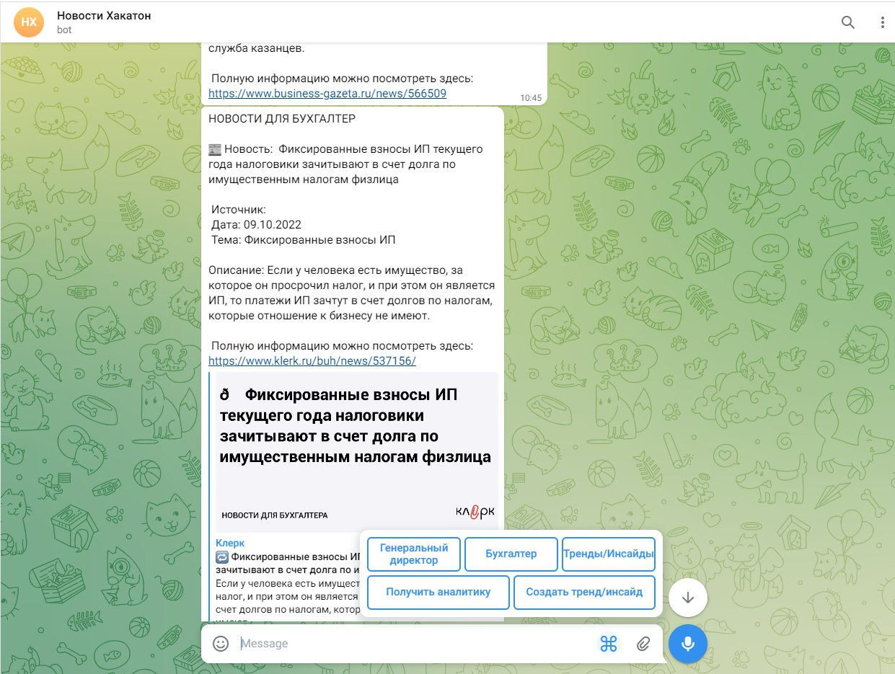

# NewsRecommendationService

*Хакатон ВТБ трек DATA*

*Команда "Герои ML и магии"*

## Краткое описание сервиса

Парсер мониторит некоторое количество новостных каналов.

Получив новость, мы извлекаем ее эмбеддинг, возможно предварительно суммаризировав её.

Когда нам приходит запрос, который содержит роль (должность) сотрудника и временной промежуток, то мы выбираем и
возвращаем 2-3 наиболее подходящие новости за этот временной промежуток, сопоставляя эмбеддинг описания должности и
эмбеддинги новостей.

## Инструкция

### Загрузка новостей в базу
- Поднять API к базе данных из репозитория `https://github.com/Leon200211/api_vtb`
- Собрать Docker контейнер и запустить `build.sh`, `run.sh`
- Положить описание ролей в папку `./roles_description/` (один текстовый файл для одной роли)
- Выделить векторные представления из описания ролей `roles.py`
- Запустить файл `website_parser.py`
- Поднять Телеграм бота из репозитория `https://github.com/Leon200211/api_vtb`
- Написать запрос телеграм боту



#### Docker контейнер

##### Определение похожести векторов

```python

import requests

json = {
    'target': [1., 2, 3, 4, 5],
    'source': [[1, 2, 3., 4, 5],
               [2, 3, 4., 5, 6],
               [3, 4, 5., 6, 7]]
}
similarities = requests.post("http://127.0.0.1:8080/get_similarity", json=json)
print(similarities.text)

>>> [0.9999998807907104, 0.9949367046356201, 0.9864400625228882]
```

##### Получение векторных пресдтавлений

```python
import requests

json = {
    'news': ['Приятная новость номер один',
             'Эмбеддер запущен в докер контейнере',
             'Api через Flask']
}

embeddings = requests.post("http://127.0.0.1:8080/get_embeddings", json=json)
print(embeddings.text)

>>> [[0.43907254934310913, -0.8340410590171814, 0.3247581720352173, 
      -0.4997189939022064, -0.09722471982240677, -0.4234312176704407, 
      1.0250037908554077, -1.0949842929840088 ...]]

```

## Инструкция по установке/использованию


...

Тренды выявляются путём кластеризация краткого описания статей - задача, которую мы производим на облаке, чтобы не нагружать основной продукт зависимостями от кучи пакетов и не использовать своё ОЗУ. Результаты мы сохраняем в json, а после рецензии администратора в базу данных. Резлуьтаты представляют из себя 10 самых ключевых слов каждого из кластеров статей, то есть слова определяющие тематику кластера. По ним можно поределяить какие тренды и инсайты можно вывести.

Код: https://www.kaggle.com/code/annkar/clustervtb

## Пример использования

...

Определение трендов
Надо запустить ноутбук, предварительно, загрузив туда данные в формате csv. В кластеризации (dbscan_search) можно указать eps_grid - какие минимальные косинусные растояния попробовать использовать и min_samples_grid - какие минимальные размеры кластеров попробовать использовать.

## Картинки

### Визуализация кластеризации

Файлы результатов: 

### Схема пайплайна


### Схема архетиктуры сервиса


